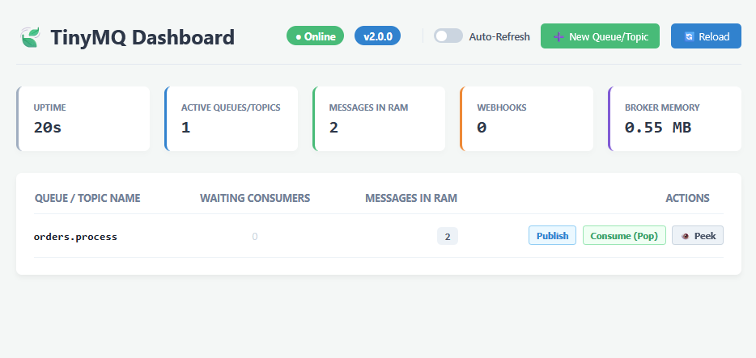

# 🍃 TinyMQ
[](https://go.dev/)
[](https://goreportcard.com/report/github.com/x-name15/tinymq)
[](LICENSE)
[](https://github.com/x-name15/tinymq/releases)
[](https://github.com/x-name15/tinymq/actions)
[](https://github.com/x-name15/tinymq/pkgs/container/tinymq)
[](https://www.docker.com/)

A tiny, ultra-lightweight message broker for side projects, prototypes, and internal tools. 
Built from scratch in Go with zero external heavy dependencies.

TinyMQ offers a true "plug & play" alternative to heavy brokers like RabbitMQ or Kafka. No complex clusters, no Erlang, no JVM — just a single Dockerized binary with built-in disk persistence, strict FIFO delivery, wildcard routing, and a simple HTTP API.

## Key Features

- **Zero Dependencies:** Pure Go implementation under ~15MB.
- **Smart Disk Persistence (WAL):** Messages are persisted to an append-only `.log` file per topic and kept in RAM for fast reads.
- **Dead Letter Queues (DLQ):** Automatically isolates "poison pill" messages after 3 failed retries to protect your workers.
- **Time-Based Routing (TTL & Delay):** Schedule delayed messages for the future or set expiration times natively.
- **Batching & Prefetch:** Consume multiple messages in a single HTTP call (`?limit=X`) to drastically reduce network overhead.
- **Broadcast / Fan-out:** Ephemeral pub/sub support to dispatch a single event to multiple independent consumers simultaneously.
- **Push Consumers (Webhooks):** Passive integration. Let the broker `POST` directly to your external endpoints.
- **Graceful Shutdown:** Syncs OS-level buffers to disk on `SIGTERM`/`SIGINT` to prevent data loss.
- **Interactive UI:** Built-in interactive Dashboard (No JS frameworks) to monitor uptime, webhooks, and active topics.

## Why use TinyMQ? 

Let's be honest: Kafka and RabbitMQ are incredible engineering marvels, but they are often **massive overkill** for small to medium projects. 
Setting up an Erlang runtime, managing JVMs, or configuring Zookeeper/Kraft clusters just to pass a few JSON messages between three microservices is exhausting.

TinyMQ solves the "over-engineering" problem. It is built for developers who need reliable, enterprise-grade asynchronous communication without the operational tax. 

**You should use TinyMQ if:**
- **You are building a side project or MVP** and want to move fast.
- **You have limited server resources** (it runs smoothly on a $4/month VPS).
- **You want true Plug & Play:** No XML/YAML config files, no heavy runtimes. Just run the binary or the ~25MB Docker image.

**You should NOT use TinyMQ if:**
- You need to process millions of messages per second.
- You need highly available, multi-node clustering and distributed consensus.

## Image of the Dashboard

- All in HTML & Vanilla JS btw

## Quick Start (Docker)

### Using the pre-built Docker images
You can pull the official image from two different registries

#### From GHCR
```bash
# From GitHub Container Registry
docker pull ghcr.io/x-name15/tinymq:latest

docker run -d \
  --name tinymq \
  -p 7800:7800 \
  -v $(pwd)/data:/root/data \
ghcr.io/x-name15/tinymq:latest
```

### Or from Docker Hub
```bash
docker pull flez71/tinymq:latest

docker run -d \
  --name tinymq \
  -p 7800:7800 \
  -v $(pwd)/data:/root/data \
  flez71/tinymq:latest
```
### And if you want, you can run the broker using our Docker Compose:

```bash
git clone https://github.com/x-name15/tinymq.git
cd tinymq
docker compose up --build
```

The broker will start on port `7800`. Data persists locally in the `./data` directory. Access the UI at `http://localhost:7800/dashboard`.

## Documentation

See the full documentation in the [`docs` folder](./docs/DOCUMENTATION.md) for API reference, SDK usage, and architecture details.

## LICENSE
TinyMQ is licensed under the GPL v3. See [`LICENSE`](./LICENSE) for details.

## Contributions

If you find bugs or want to improve TinyMQ then:
1. Fork the repo
2. Create a branch with your feature
3. Open a PR

### Credits
**Author:** Mr Jacket 
